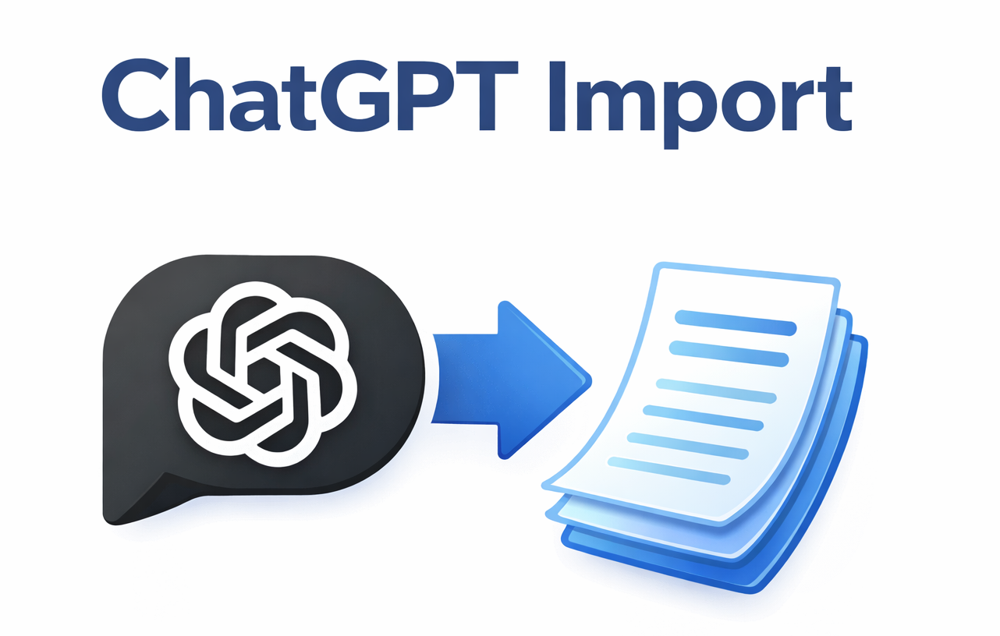

# ChatGPT Import Plugin for Joplin



ChatGPT is a useful tool, but its privacy policy may raise concerns, and you may not like the idea of having all your conversations stored on remote servers. These servers can be hacked, or the data could potentially be accessed by governments or other authorities.

This plugin allows you to export your chat history from ChatGPT and import it into Joplin. Your conversations are then stored locally in your notes, either kept offline or securely synchronised using end-to-end encryption. Once your chats are safely archived in Joplin, you can delete them from ChatGPT with peace of mind.

Because ChatGPT exports can be large, and you may prefer to synchronise them differently from your regular notes (or not synchronise them at all), you might want to [create a new profile](https://joplinapp.org/help/apps/profiles/) dedicated to this data.

## Features

- Import ChatGPT export archives (ZIP files) directly into Joplin
- Preserves conversation structure with user/assistant messages
- Imports attached images, audio, and video files as Joplin resources
- Configurable note titles with date/time formatting
- Optional collapsible sections for tool outputs
- Preserves original conversation timestamps

## Usage

1. Export your data from ChatGPT:
   - Go to ChatGPT Settings > Data Controls > Export Data
   - Wait for the export email and download the ZIP file

2. Import into Joplin:
   - Go to **File > Import > ChatGPT Export (ZIP)**
   - Select your downloaded ZIP file
   - Wait for the import to complete

All conversations will be imported into a new "ChatGPT Import" notebook.

## Settings

Configure the plugin in **Tools > Options > ChatGPT Import**:

| Setting | Description | Default |
|---------|-------------|---------|
| User name | Display name for user messages | `User` |
| Assistant name | Display name for assistant messages | `ChatGPT` |
| Note title format | Format string for note titles (see below) | `{date} {title}` |
| Show date in note body | Display conversation date below the title | `false` |
| Use collapsible sections | Wrap tool outputs in collapsible `<details>` tags | `true` |
| Include thinking/reasoning | Include internal thinking messages from the assistant | `false` |
| Quote user messages | Display user messages in blockquotes | `true` |

### Title Format Placeholders

- `{title}` - The conversation title
- `{date}` - Date in YYYY-MM-DD format
- `{date:FORMAT}` - Date with custom format
- `{time}` - Time in HH:MM format

Custom date FORMAT can use: `YYYY`, `YY`, `MM`, `M`, `DD`, `D`

Examples:
- `{date} {title}` → "2024-01-15 My Conversation"
- `{title} ({date:MM/DD/YY})` → "My Conversation (01/15/24)"
- `{date} {time} - {title}` → "2024-01-15 14:30 - My Conversation"

## Building from Source

```bash
npm install
npm run dist
```

The built plugin will be in the `publish/` directory.

## Credits

- Code to do the Markdown conversion based on [ChatGPT Conversations To Markdown
](https://github.com/daugaard47/ChatGPT_Conversations_To_Markdown) by [daugaard47](https://github.com/daugaard47)

## License

MIT
